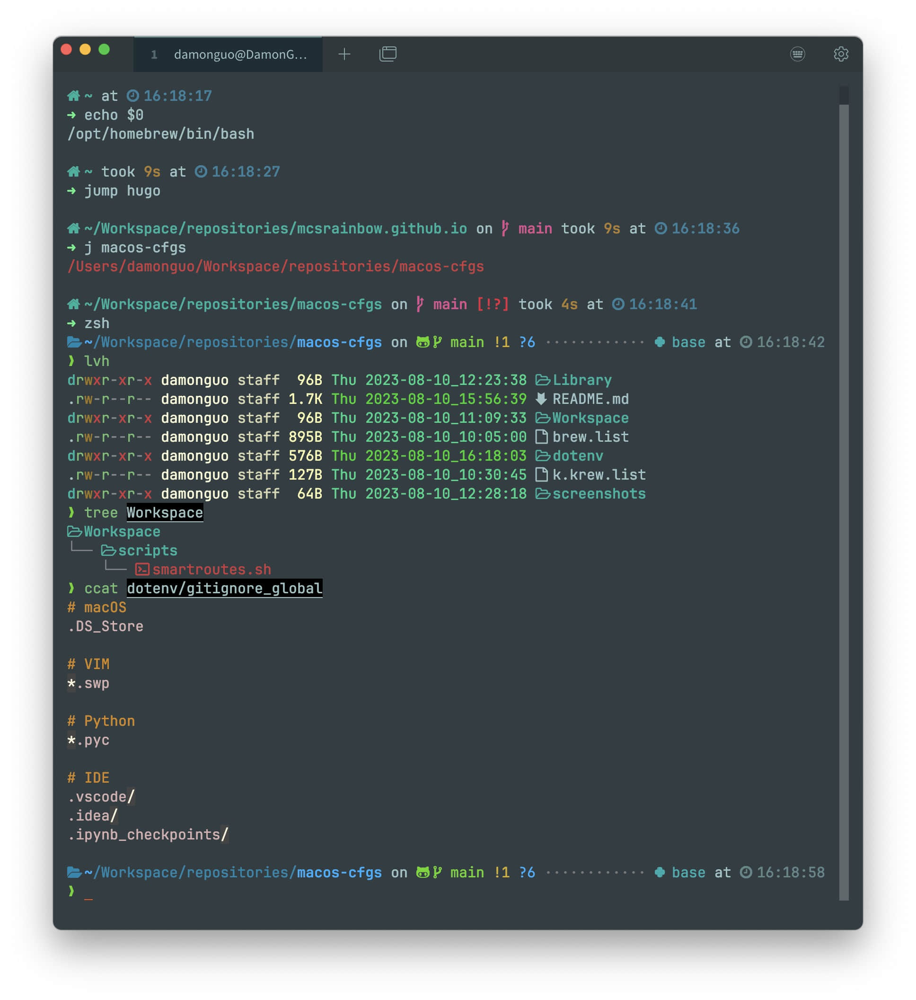
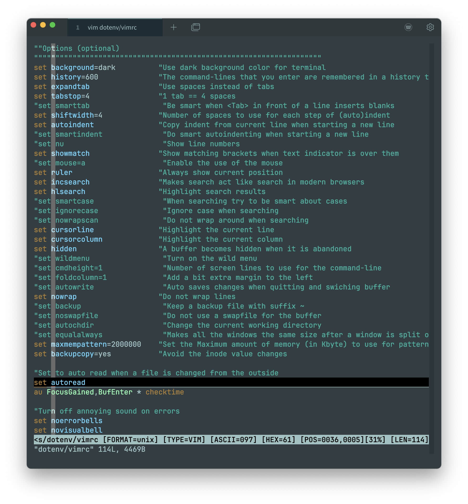

# macos-cfgs

Personal macOS configurations

## List all files as a tree

```
tree --dirsfirst
.
├── dotenv
│   ├── config
│   │   ├── ghostty
│   │   │   └── config
│   │   ├── kitty
│   │   │   ├── kitty.conf
│   │   │   └── solarized_dark_higher_contrast-theme.conf
│   │   ├── pip
│   │   │   └── pip.conf
│   │   └── starship
│   │       ├── icons_in_starship.jpg
│   │       ├── README.md
│   │       └── starship.toml
│   ├── kube
│   │   ├── config.d
│   │   │   └── rename_kubeconfig.sh
│   │   ├── gencfg_orbstack.sh
│   │   └── update_kubeconfig.sh
│   ├── obsidian
│   │   └── plugins
│   │       └── obsidian-style-settings
│   │           └── data.json
│   ├── orbstack
│   │   └── config
│   │       └── docker.json
│   ├── ssh
│   │   └── config
│   ├── bash_profile
│   ├── bashrc
│   ├── bashrc.custom
│   ├── editorconfig
│   ├── gitconfig
│   ├── gitconfig-swireproperties
│   ├── gitignore_global
│   ├── inputrc
│   ├── p10k.zsh
│   ├── vimrc
│   ├── zprofile
│   ├── zshrc
│   └── zshrc.custom
├── Library
│   └── Fonts
│       ├── JetBrainsMapleMono
│       │   └── README.md
│       ├── JetBrainsMono
│       │   └── README.md
│       └── MapleMono
│           └── README.md
├── screenshots
│   ├── tabby_bash-starship_ohmyzsh-p10k.jpg
│   └── vim_vimrc.jpg
├── Workspace
│   └── scripts
│       └── smartroutes.sh
├── brew.list
├── k.krew.list
└── README.md

23 directories, 35 files
```

## Screenshots





